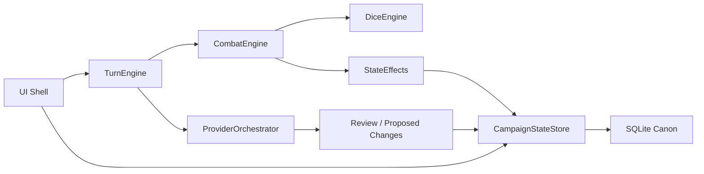

# LoreKeeper Product Maturity Review

Date: 2026-06-13

This review treats LoreKeeper as a tabletop RPG product, not only a codebase. The current direction is correct: the app is becoming the game engine and the provider is becoming a creative DM assistant. The largest remaining risk is uneven migration: some flows now use engines while older UI/provider paths still carry state assumptions from the monolith.

## Executive Findings

| Rank | Area | Finding | Recommendation |
| --- | --- | --- | --- |
| Critical | State / Turn Flow | `app/app.js` still contains too much gameplay orchestration, so old and new state machines can coexist. | Continue extracting send, recovery, review, and multiplayer turn aggregation into engines until app.js is mostly rendering and wiring. |
| Critical | Combat | Combat is visibly improved, but combat resolution can still depend on provider compliance for narration shape and turn advancement hints. | Keep moving rolls, effects, victory, and initiative advancement into `CombatEngine`; provider should only narrate resolved action records. |
| High | Security | The desktop API binds for LAN table support, which makes route classification important. Private API routes are token protected; guest routes rely on invite/connection secrets. | Keep private/guest route split explicit, validate invite hosts, protect local assets, and add route-level security tests. |
| High | Multiplayer | Host authority exists, but guest state sync is still mediated through renderer logic and can feel opaque. | Promote multiplayer session state into a dedicated engine projection with clear pending/approved/submitted states. |
| High | DM Quality | The DM prompt now has long-running campaign guidance, but context retrieval is still coarse and recent-message heavy. | Retrieve by scene, actors, relationships, active threads, and consequences instead of mainly broad context packs. |
| Medium | Performance | Whole campaign snapshots are convenient but will become expensive with long campaigns and image metadata. | Keep snapshot writes atomic for now, but use schema 2.0 normalized tables for queryable logs and future incremental writes. |
| Medium | UI Effectiveness | The UI now shows mode/combat/provider state, but some panels still report implementation status instead of user-meaningful table state. | Rename panels/statuses around table concepts: Waiting on DM, Your turn, Host reviewing, Guest staged, Needs repair. |
| Medium | UI Comfort | The tabletop chatroom style is promising, but the central canvas can waste space and scrolling/debug UI can compete with play. | Preserve readable chat density, keep debug tools tucked into Settings, and avoid auto-scrolling unless the user is already near latest. |
| Low | Data Storage | Campaign deletion now physically removes SQLite stores and index entries, which matches dev-phase expectations. | Before public release, add backup/export affordances and a recycle/undo story. |

## Area Notes

### 1. Security

Strengths:
- Electron has context isolation and no renderer Node integration.
- Private API calls use a per-launch token.
- Campaign mutations include a campaign/sqlite pin to reduce stale writes.
- Guest actions require invite tokens, connection ids, client ids, and connection secrets.

Weaknesses:
- LAN support means the API process can be reachable beyond loopback.
- Local assets were previously readable without the launch token if the path was allowlisted.
- Invite links accepted arbitrary hosts, which could make ThinLoreKeeper contact non-local endpoints.
- Electron navigation and permission handling needed explicit denial guards.

Implemented in this pass:
- Electron renderer sandboxing, explicit web security, permission denial, and navigation guard.
- `/local-asset` now requires the launch token when desktop auth is enabled.
- Rendered local asset URLs include the launch token.
- Invite links now reject non-local/non-private hosts.
- API responses now include `nosniff` and `no-referrer` headers.

Remaining risks:
- Route authorization is hand-classified in `scripts/serve.js`; add tests around every public/private route.
- Future internet multiplayer will need a different auth model than LAN invite secrets.
- Imported files should eventually be scanned into an app-owned asset store instead of referenced from arbitrary source paths.

### 2. Performance

Likely first bottlenecks:
- Long `sessionLog.messages` renders and context-pack construction.
- Whole-snapshot SQLite writes as campaigns grow.
- Provider prompts that include more state than a task needs.
- Diagnostics and logs if kept open during long sessions.

Recommendations:
- Virtualize chat rendering before very long campaigns.
- Use schema 2.0 log tables for retrieval and audit.
- Cap provider context by task and mode.
- Keep diagnostics bounded and user-triggered.

### 3. Multiplayer State

Strengths:
- Host is authoritative.
- Guests do not mutate SQLite directly.
- Controller assignment and fallback concepts exist.

Risks:
- Guest sync state still lives partly in UI code.
- Host review/stage/submit language is still settling.
- Disconnection recovery exists, but should become more visible.

Recommendations:
- Introduce a multiplayer projection owned outside app.js.
- Show seat state directly on party cards: pending, approved, staged, submitted, disconnected.
- Keep guest endpoints narrowly scoped to join, snapshot, action, pass, disconnect.

### 4. State Management

Canonical state is SQLite. Derived state should come from:
- `CampaignStateStore` for in-memory projection.
- `TurnEngine` for turn lifecycle.
- `CombatEngine` for initiative, HP, actions, effects.
- `AgencyController` for actor control.
- UI projections for rendering.

Main duplication risk:
- `app/app.js` still calculates and patches some gameplay state.

Recommendation:
- Continue moving repair, post-turn recovery, combat inference, and remote-input aggregation behind engine APIs.

### 5. DM Influence / DM Quality

The provider should act like a long-running DM, not a generic continuation model.

Recent improvements:
- Provider task requests now carry DM quality policy.
- Prompt rules discourage random escalation and generic encounters.

Next improvements:
- Retrieval should prefer active place, present actors, relationships, unresolved threads, and consequences.
- Provider tasks should be named and narrow: narrate resolved action, choose NPC intent, suggest companion action, scene beat.
- Add regression fixtures for “do not spawn random bandits” style failures.

### 6. Combat Flow

Strengths:
- Combat tracker exists.
- HP display is emerging.
- Victory reconciliation has begun.
- Mechanics rows are more readable than raw prose.

Risks:
- Combat still sometimes accepts provider-shaped mechanics text.
- Active actor and legal action handling needs to be fully engine-owned.
- Turn advancement must never depend on provider phrasing.

Recommendations:
- Store `CombatActionRecord` for every combat turn.
- Render roll records from app-owned dice data.
- Provider narrates after rolls/effects are known.
- Auto-end combat when no hostile active combatants remain.

### 7. Non-Combat RP Flow

Strengths:
- Freeform input exists.
- Nudge gives the DM a way to continue.
- Choices are optional rather than mandatory.

Risks:
- Provider can still be too terse or too option-list driven.
- Consequence tracking is not yet a first-class retrieval feature.

Recommendations:
- Separate “scene beat” from “ask for choice”.
- Let the DM narrate without choices when no immediate decision is needed.
- Track consequences as lightweight thread/state notes.

### 8. Architecture

The architecture is moving in the right direction. The product should continue toward:

The main architectural debt remains `app/app.js`.

### 9. Data Storage

Strengths:
- SQLite is the right local-first canon.
- Schema 2.0 includes normalized engine logs.
- Campaign deletion now removes store files and index entries.

Recommendations:
- Add migrations as explicit versioned modules before public release.
- Add backup/export before destructive delete in release builds.
- Store assets under app-managed paths for portability.

### 10. UI Cleanliness

Improvements needed:
- Make provider status user-centered, not implementation-centered.
- Keep debug/repair controls in Settings unless action is required.
- Make join/invite flows visible on party cards.

### 11. UI Effectiveness

The UI should always answer:
- What mode are we in?
- Whose turn is it?
- Who controls them?
- What is waiting on me?
- What changed mechanically?
- Is the DM generating, stuck, or recoverable?

Combat and multiplayer are the places where this matters most.

### 12. UI Comfort

The app is close to a good “tabletop chatroom” feel. Keep:
- Comfortable line length.
- Stable scroll behavior.
- Low visual noise.
- Debug tools out of the play lane.
- Clear but restrained mechanics cards.

## Product Roadmap

1. Finish app.js extraction into engine-owned flows.
2. Make combat fully app-resolved: action records, rolls, HP/resources, victory, initiative.
3. Build a dedicated multiplayer state projection and clearer seat UI.
4. Improve context retrieval around consequences, relationships, and active threads.
5. Add route-level API/security tests.
6. Add long-campaign performance fixtures.
7. Add backup/export and asset-store management.
8. Polish chat/scroll ergonomics for multi-hour sessions.

## Technical Debt

- `app/app.js` remains the highest-risk file.
- The first renderer extraction cut moved multiplayer panel projection, input composer projection, and proposed-change panel projection out of `app/app.js`; remaining risk is concentrated in submit/import/repair and implicit combat recovery.
- Provider import/review code still carries legacy assumptions.
- Route authorization is centralized but not exhaustively tested.
- Context packs are better than raw giant prompts, but not yet retrieval-grade.
- Combat mechanics records are not yet the only source of combat truth.
